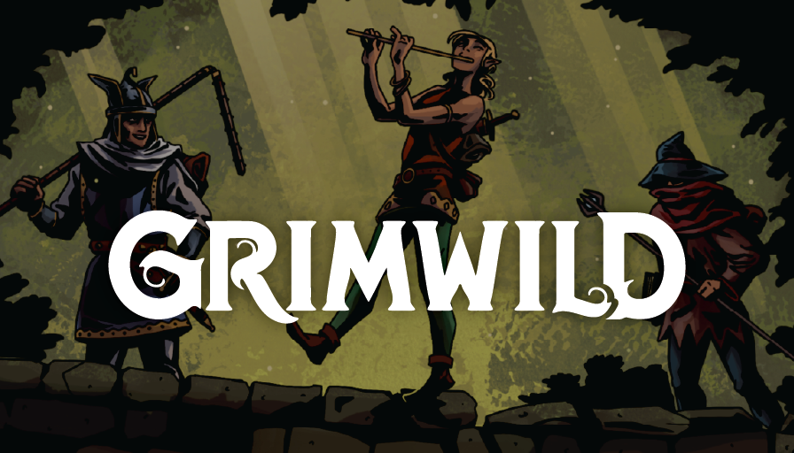

<p align="center">
  
</p>

# Grimwild en castellano para Foundry VTT

**Traducción no oficial** al castellano del sistema [Grimwild para Foundry VTT](https://github.com/asacolips-projects/grimwild),
con la interfaz, los compendios y las herramientas de juego completamente localizados.

Este repositorio **no es el sistema original** ni reclama autoría sobre Grimwild, Moxie, el sistema de Foundry original,
sus compendios, logotipos, texturas ni demás recursos. Es una localización derivada. Consulta [Créditos y aviso legal](#créditos-y-aviso-legal).

> **Sustituye al sistema original.** Conserva el identificador `grimwild` para que funcionen las referencias internas de
> los compendios (`Compendium.grimwild…`) y los mundos ya creados. No se puede instalar a la vez que el Grimwild oficial.

- Versión: **0.5.3-es.3** (basada en Grimwild 0.5.3 para Foundry). Historial en [CHANGELOG.md](CHANGELOG.md).
- Foundry VTT: **v13** (verificado en 13.351). No es compatible con v14.

## Características

- **Interfaz completamente en castellano**: fichas, diálogos, chat, ajustes, avisos y ayudas.
- **Compendios revisados** frente al original inglés, con un [glosario](docs/GLOSARIO.md) común:
  - Reglas de Grimwild.
  - Talentos de los catorce Caminos.
  - Arcana: arcanos menores, mayores y míticos.
  - Monstruos, con sus desafíos, tablas, sensaciones y colores.
  - Crisoles: tablas aleatorias para conjuros, oleadas salvajes, herboristería y el DJ.
  - Herramientas del DJ.
- **Creación de personajes** guiada paso a paso o completamente aleatoria.
- **Suspense y reservas rápidas** siempre a mano sobre la barra de macros.
- **Tracker de combate** a la manera de Grimwild: foco, fichas de acción, Chispa y daño.

## Experiencia de juego

**Ficha de personaje.** Separa lo que se usa jugando de lo que se configura de vez en cuando:

- Arriba, los controles de juego: atributos, Marcas, Ensangrentado / Alterado / Derribado, Chispa e Historia.
- Toda la tarjeta de un atributo es clicable para tirar.
- Los estados se distinguen por icono, texto y forma, no solo por color.
- La ficha se adapta al ancho de su propia ventana:
  - ancha, con un lateral de identidad;
  - de una columna, con los controles de juego primero;
  - estrecha, con las pestañas en un menú.
- **Modo compacto** para escenas y combates (botón en la barra de la ventana): atributos, daño, Chispa, Historia,
  condiciones activas y reservas de talentos, en unos 400 px.

**Creación de personajes.**

- El **asistente guiado** sigue los pasos del reglamento en una sola ventana:
  - trasfondos, de la tabla o del crisol de ascendencia;
  - rasgos y deseos;
  - aspecto;
  - camino, con su talento principal y un segundo talento;
  - atributos, repartiendo 1 + 4 puntos, con un máximo de 3;
  - arcos y vínculos con los demás PJ.
- Cada paso tiene su dado, y «Todo al azar» rellena el personaje completo.
- **Personaje aleatorio** crea un PJ jugable con un clic.
- Se abre desde el directorio de actores y desde el menú de la ficha. También al crear un personaje vacío,
  si está activado el ajuste.

**Tiradas.**

- El diálogo muestra en grande cuántos **dados** y cuántas **espinas** vas a tirar, con sus fuentes debajo:
  - dados: atributo, Chispa y ayudas;
  - espinas: Marca, daño, condiciones y dificultad.
- Las ayudas de otros PJ se añaden con un clic.
- El chat muestra el resultado (crítico, perfecto, complicado, sombrío o desastre) con icono y texto, y remarca el dado que cuenta.
- Desde el mismo mensaje puedes aplicar marcas y daño, o ganar chispa.

**Herramientas del DJ.**

- El Suspense y las reservas rápidas de la escena tienen un modo de juego (ver y tirar) y otro de configuración
  (renombrar, dados, visibilidad, borrar, añadir), que se activa con el engranaje.
- Fichas de monstruo con banda de colores sensoriales, sensaciones, rasgos, movimientos, deseos, tablas y desafíos.
  Los desafíos se reparten en 3, 2 o 1 columnas según el ancho.

**Ayuda contextual.** Deja el puntero sobre un concepto (atributo, Marca, Chispa, espinas, Suspense…) o haz clic derecho
(pulsación larga en táctil, F1 con el teclado): aparece una explicación breve con enlace a la regla del compendio.

**Memoria de ventanas.** Cada ficha recuerda, por usuario y mundo, su posición, tamaño, pestaña, secciones desplegadas,
desplazamiento y modo compacto. Los tamaños se ajustan a la pantalla actual. Se puede borrar desde los ajustes del sistema.

**Accesibilidad.**

- Todos los controles se pueden usar con el teclado, con pestañas navegables con las flechas.
- Hay etiquetas para lectores de pantalla.
- Las áreas táctiles son amplias.
- El ajuste «Modo de accesibilidad» aumenta el texto, el contraste y el tamaño de los controles.

### Capturas pendientes

Todavía no hay capturas en el repositorio. Conviene añadir capturas reales (sin maquetas) de:

- la ficha de personaje, ancha y en modo compacto;
- el diálogo de tirada y un resultado en el chat;
- una ficha de monstruo con desafíos;
- la barra de Suspense con reservas rápidas;
- el tracker de combate.

## Instalación

Instala desde **Configuración → Sistemas de juego → Instalar sistema**, con esta URL de manifiesto:

```text
https://github.com/ManuRomera/grimwild-es/releases/latest/download/system.json
```

Cada versión se publica como *release* de GitHub, con su `system.json` y su `grimwild.zip`, así que Foundry avisa de
las actualizaciones y las instala desde su gestor de sistemas.

**Si el repositorio es privado**, Foundry no puede descargar el manifiesto ni el zip, porque no se autentica en GitHub.
En ese caso, descarga `grimwild.zip` de la release y descomprímelo en `FoundryVTT/Data/systems/grimwild`.

Si ya tienes instalado el Grimwild oficial, **esta versión lo sustituye**: haz copia de tus mundos antes.

**Si importaste monstruos con una versión anterior**, sus tablas quedaron vacías por un fallo de datos del sistema
original, ya corregido. Vuelve a importarlos desde el compendio para recuperarlas.

## Desarrollo

Las fuentes mantenibles están en `src/`; Foundry carga los archivos generados.

| Fuente | Se genera en | Comando |
|---|---|---|
| `src/vue/` (componentes Vue) | `vue/components.vue.es.mjs` | `npm run build:vue` |
| `src/styles/` (SCSS) | `styles/grimwild.css` | `npm run build:css` |
| `src/packs/<pack>/*.json` | `packs/<pack>` (LevelDB) | `npm run build:packs` |

```bash
npm install
```

```bash
npm run build
```

```bash
npm run check
```

```bash
npm test
```

**Publicar una versión:** sube la versión en `system.json`, incluido el `download` con la etiqueta nueva, y añade la
entrada a `CHANGELOG.md`. Después sube la etiqueta `v<versión>`: el flujo `Publicar` valida y crea la release.

- `npm run check` busca claves de traducción que falten, textos en inglés sin traducir en plantillas y componentes,
  JSON inválidos y enlaces `@UUID` rotos en los compendios.
- `npm run unpack` vuelca a `src/packs` los compendios editados dentro de Foundry.
- Edita los compendios en `src/packs`, **no** en los LevelDB, y respeta el [glosario](docs/GLOSARIO.md).
- `lib/vue.esm-browser.js` debe tener la misma versión que el paquete `vue` de `package.json` (3.5.16).

## Créditos y aviso legal

- **Grimwild** © 2024 J.D. Maxwell y Oddity Press, con licencia
  [CC BY 4.0](https://creativecommons.org/licenses/by/4.0/). Basado en **Moxie** © 2024 J.D. Maxwell y Oddity Press (CC BY 4.0).
  [odditypress.com](https://www.odditypress.com/)
- **Sistema original de Foundry VTT**: Asacolips y colaboradores (Gil, CalmRush, Phoenix), con licencia MIT.
  [asacolips-projects/grimwild](https://github.com/asacolips-projects/grimwild) ·
  [paquete en Foundry](https://foundryvtt.com/packages/grimwild)
- Los compendios, logotipos y texturas de `assets/` se incluyen en el sistema original con permiso de Oddity Press.
- **Noto Serif** © The Noto Project Authors, con licencia SIL Open Font License 1.1
  ([`assets/fonts/noto-serif/OFL.txt`](assets/fonts/noto-serif/OFL.txt)).
- Las fuentes de títulos y dados («tiller», «greycliff-cf») son de Adobe Fonts. Se cargan desde el kit del sistema
  original y **no se distribuyen**; sin conexión se usan fuentes alternativas.
- **Traducción no oficial al castellano**: ManuRomera.

Esta traducción no está afiliada a Asacolips, J.D. Maxwell, Oddity Press ni Foundry Gaming LLC. Si algún titular de
derechos pide cambios, más atribución o la retirada de material, se atenderá. Consulta [`NOTICE.md`](NOTICE.md) y [`LICENSE`](LICENSE).
